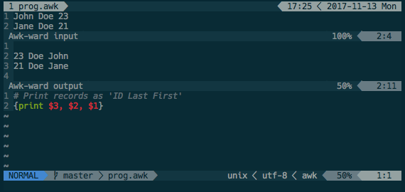

.. SPDX-FileCopyrightText: © 2022 Alejandro "HiPhish" Sanchez
.. SPDX-License-Identifier: CC0-1.0

.. default-role:: code

#######################################
 Awk-ward - Run Awk programs in Neovim
#######################################

Awk-ward allows you to try out Awk scripts right in your editor; you provide
the input as either a file or a buffer and the output is displayed in an output
buffer. Best of all, you don't even have to write your program or data to disc,
Awk-ward will read straight from the buffer, and you can experiment without
breaking any of your programs.

Setup and quick start
#####################

Install Awk-ward like any other Neovim plugin. You also need an implementation
of Awk installed on your system. If you have more than one you can specify the
path to the binary by setting the `g:awkprg` variable (global) or `b:awkprg`
(local). The default Awk implementation is whatever your `awk` command resolves
to.

Example session
===============

Open a buffer with an Awk program (you do not have to write the buffer to a
file). We'll use the following as an example:

.. code:: awk

   # Print records as 'ID Last First'
   {print $3, $2, $1}

Now run `:AwkWard` and two new buffers will open, one for input and the other
one for output. Enter some text into the input buffer:

.. code::

   John Doe 123

Once you exit insert-mode the output buffer will show the Awk output

.. code::

   123 Doe John

Note that you did not have to save the input buffer, the output gets updated
live. The output also updates live when you edit the program buffer. Suppose
now that we want to change our input from a buffer to a file. We can execute
the command again with our new settings: `:AwkWard -infile data.txt`. The input
buffer will be closed and the output will show the result from processing the
file `data.txt`.

Status of the project
#####################

Awk-ward is feature-complete and ready for use. Keep an eye on the TODO_ file
for new ideas.

.. _TODO: TODO.rst

License
#######

The source code is released under the MIT (Expat) license, the documentation
and supporting test files under the CC0-1.0 license.  See the LICENSES_
directory for details.

.. _LICENSES: LICENSES
